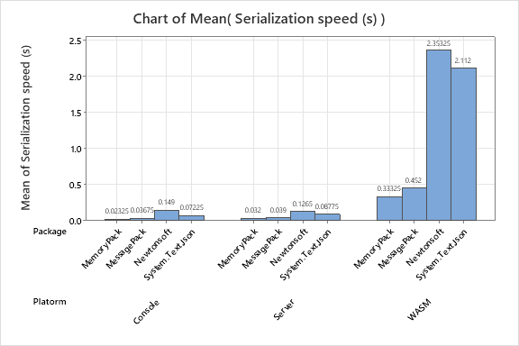
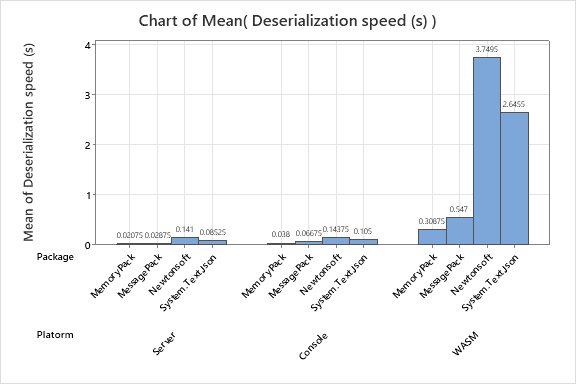

# Serialization and Deserialization

This project was created to complete a statistical analysis on the serialization and deserialization times of different packages and different platforms. The abstract is included below, and the full report can be found in `./Report.pdf`

## Platorms tested
- Blazor WebAssembly
- Blazor Server
- C# Console application

## Packages tested 
- `System.Text.Json`
- `NewtonSoft`
- `MessagePack`
- `MemoryPack`

## Inspiration

With my academic background in computer science and applied statistics, I am able to combine both fields to produce valuable insights. In a recent project for Franchise Technologies, Inc. (FTI), I utilized MemoryPack to optimize application performance. As part of my work, I conducted tests on several packages to identify which would work best for the application I was writing. I ran a full experiment on the commonly used platforms and packages in my work for FTI to ensure my decision was correct. This repository contains my code, the data I gathered, and a statistical analysis of the results.

## Abstract

The present study aimed to investigate the effects of Package and Platform on Serialization and Deserialization times, as well as their interaction effect. A factorial design was used to analyze the data collected from different platforms, including Console, Server, and WebAssembly (WASM), and different packages, including MemoryPack, MessagePack, Newtonsoft, and System.Text.Json. The analysis of variance (ANOVA) results indicated significant main effects for both Package and Platform on the Serialization and Deserialization times. Moreover, the interaction effect of Package and Platform was also found to be significant for deserialization, but not serialization. This indicates that the effect of package on serialization and deserialization times varied depending on the platform used for only deserialization. MemoryPack package showed the fastest serialization and deserialization times compared to other packages, and this effect was more pronounced on the Console and Server platforms compared to the WASM platform. These findings can have practical implications for developers who want to optimize the performance of their applications by selecting the appropriate Package and Platform.

## Results

